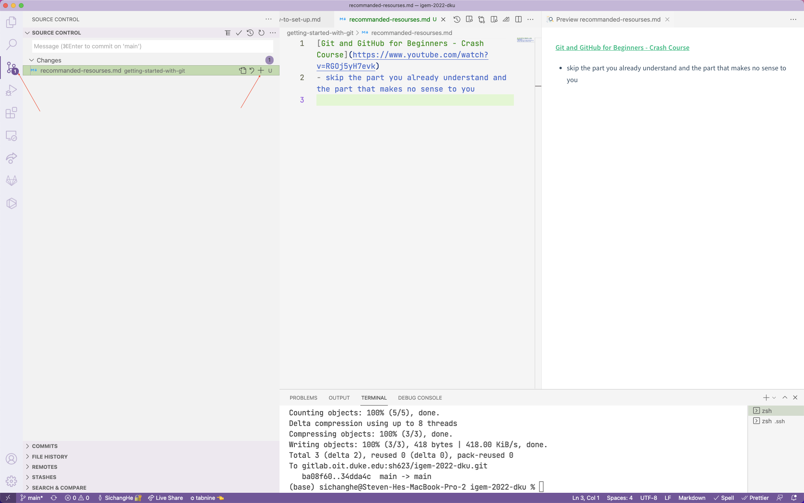
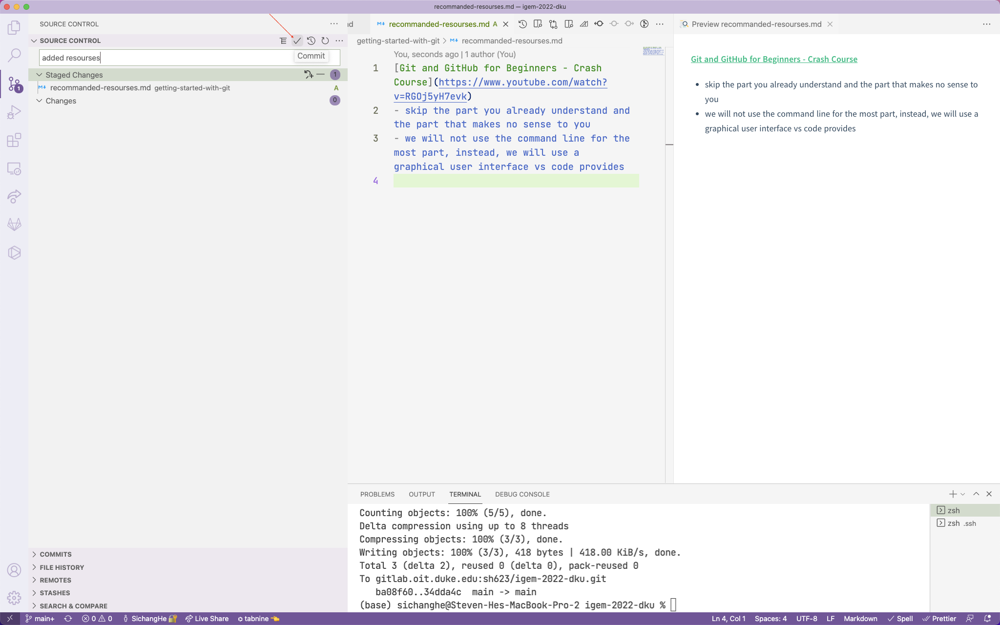
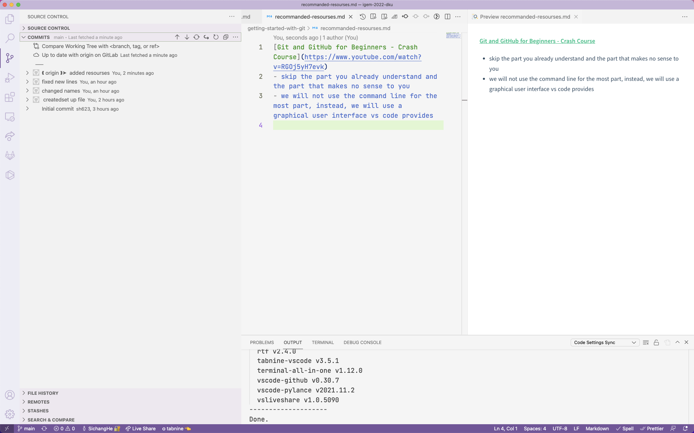
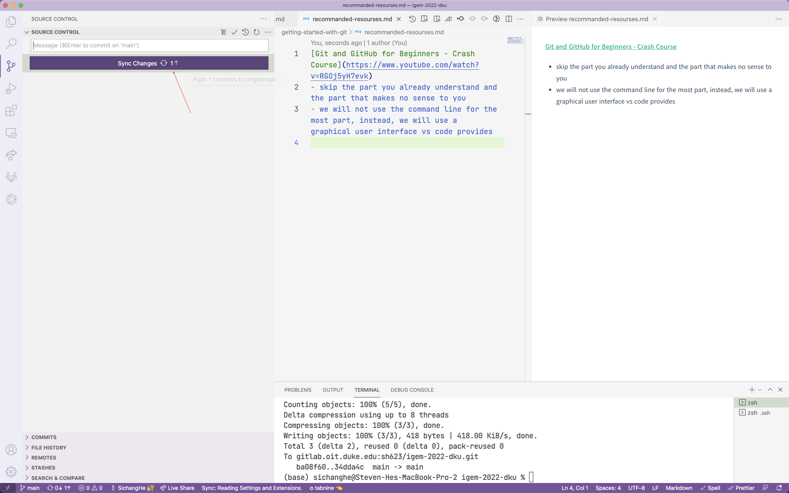
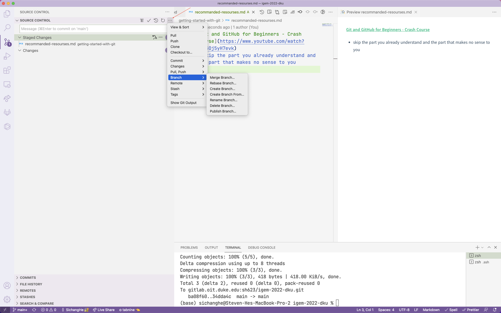

## mechanism
#### a repository
a thing that stores all the project files 
#### git
a program that helps you do version control
#### version control
record and see all changes to a project, and its different branches. show the difference between any versions
#### branches
different series of versions that can exist at the same time, so the versions of the project is like a tree, starting from the main branch which is called "master"
#### branching
making branches, so that the "master branch" does not change when the new branches are changed in case something wrong happens
#### merge
take 2 different versions (usually 1 from the master branch and 1 from another branch) and return 1 version of the project
## action
#### git clone
download the git repository
#### git add
tell git which files to care about

choose the files in vs code and click the "+" button to add them
#### git status
all the information about git in this project
vs code Source Control updates and shows these by default as you see in all these pictures
#### git commit
tell git to record the changes to all the files added (record the files themselves if newly added)
always add some concise description text

the commit message will be shown in the commit history

#### git pull
synchronize changes from the online git repository to your local computer
#### git push
upload your local changes recorded by git to the online git repository

notice that you do both in vs code in one click
but also notice that "push" will replace whatever was there in the online git repository
#### git branch
you can access branching in vs code by clicking the "…"

if you are not sure whether your changes will work, please always create a new branch and edit that branch, and push that branch when you finish, and then merge your branch with the master branch if it works