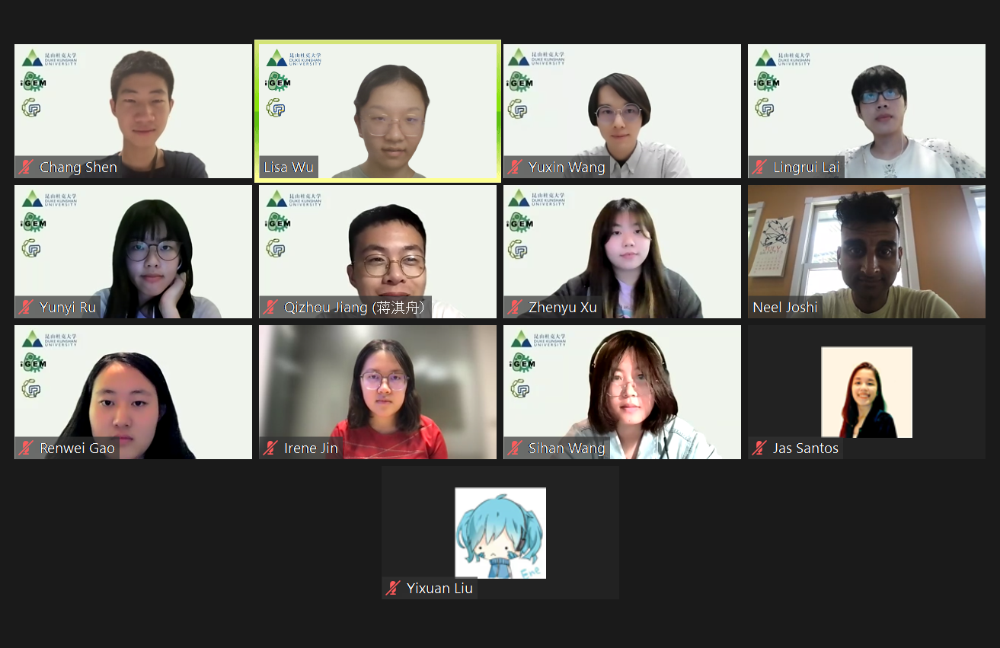

# Interview with Dr. Neel Joshi

## Introduction

Dr. Neel Joshi is an expert in bioengineering
with tracks in human disease and new therapies.
In his 2019 and 2021 literature,
he and his team described genetically engineering E. coli Nissle 1917
to treat some gastrointestinal diseases like bowel inflammation,
which provide essential references for our project.
To further understand the logics and advantages of this bioengineered model,
we invited Dr. Joshi for an interview.

## Interview Content  

**Q:**
What stimulated you and your team to develop
the surface-displaced single domain antibodies?
What practical problems do you think this model can solve?

**A:**
Although the nanobodies have great potentials in treating gastrointestinal diseases,
it is somewhat hard to deliver those nanobodies directly to the digestive track.
Therefore,
the probiotics can serve as a scaffold to make the delivery of nanobodies easy.

**Q:**
But why did you choose to display the nanobodies on the surface?
Why not directly make the bacteria synthesize nanobodies and release them?

**A:**
The surface display resolution has the property of multi-valency.
By displaying the nanobodies on the surface,
we would have the potential to space the binding domains together
to bind to a pathogen surface.
It could increase binding affinity and decrease the dissociation constant.
It can also diffusion into different directions and increase the local concentration.

**Q:**
What about the method of drug delivery?
That is to say,
how do you decide to send the engineered probiotics to human gastrointestinal track?
And could you explain why you use that delivery method?

**A:**
We only proposed an approach of micro biological therapy.
But to deliver the bacteria,
I think it can be freeze-dried to produce a freeze-dried product.
Because a large portion of the geographical locations
that suffered from these gut problems are the poor areas,
and those areas do not have the condition
to store the bacteria that require a very low temperature.
The freeze-dried products do not require that strict storage conditions,
so they are more available in those areas.

**Q:**
Why pBbB8k plasmid backbone with kanamycin selection marker?
(what's the difference between pUC19,
which is our choice,
and pBbB8K?)

**A:**
pBbB8k is a rather arbitrary choice,
we simply chose it
because it was used due to antibiotics incompatibility in the previous experiment.
When doing in vivo studies,
we engineered plasmids from the original E. coli Nissle genome,
the pMUT plasmids.
These plasmids are more stable than the pBbB8K.
For pUC19,
I don’t see problems with the expression of pUC19 plasmid.
However,
you do need to consider if your antibiotic resistant marker
in the plasmid is compatible with the shigella testing.
If shigella is killed due to the antibiotic selecting E. coli,
it can be a problem.

**Q:**
What are the setbacks of
the Probiotic-associated therapeutic curli hybrids (PATCH) system?

**A:**
The first is safety concerns of curli fibers.
It has been known that curli fibers induce various types of diseases,
including neurological diseases,
etc.
The other is inherit disadvantages for E. coli to produce curli fibers in vivo.
However,
we have been able to shown effective production of curli fiber in vivo
by measuring the amount of curli fibers coming from the fecal samples.

**Q:**
What if the E. coli went out of control and grow infinitely in the gut,
disrupting the original gastrointestinal microorganism environment?

**A:**
This is a very popular question when it comes to distributing microbes to gut.
Actually,
we could use some of the auxotrophic strains to limit the growth of the bacteria.
And I think there are many “switches”
that can turn on the suicide program of those bacteria.
But in this case,
I think E. coli Nissle 1917 is a very safe bacteria,
it has already been identified as a harmless bacterium,
so there should be less safety issues of this strain.

## Q&A Section

**Q:**
Is it possible to apply magnetic triggers to shigella infection
and cooperate this into the PATCH system?

**A:**
Magnetic triggers are mostly applied in cancer treatment.
This is because in cancer,
you know the spot of the disease.
In bacterial infection it’s hard to locate.

**Q:**
In Barta et al.,
the authors described the different indexes of the nanobodies,
including binding domains and neutralization effects.
What is your rationale when choosing the nanobodies?

**A:**
It really depends on how you generate the nanobodies.
When different parts of the pathogen are used in Alpaca immunizations,
the nanobodies will vary.
When displaying the nanobodies,
some work and others don’t.
We assume this is because of folding problems,
but we did not figure out the exact reason.  

**Q:**
What do you think about sequence optimization in silica?
Do you have experience working with this?
Do you have any suggestions?

**A:**
I would suggest generating different mutations in the sequence
and do some docking analysis.
Then generate the mutations and do wet labs.  

**Q:**
Our project aims to tackle the antibiotic resistance problem worldwide.
Would the PATCH system generate drug resistance issues?

**A:**
This is possible.
For example,
a mutation in the binding domain of the antigen might cause binding problems.
However,
I would say the selective pressure by the nanobody is smaller
compared to that of the antibiotic.
This is because antibiotic kills the pathogen,
while PATCH only binds to the pathogen,
keeping it from invasive activities.  

**Q:**
We are worried
that the proteins in the GI tract environment would coat the surface of the probiotic,
which would cause dysfunction of the nanobodies.
How did your team encounter this problem?

**A:**
The animal model was effective,
which was sufficient to show
that the GI tract environment did not inhibit the binding activity.
The curli production is continuous in vivo,
which provides adequate chance for the binding to occur.
However,
the proteases in the GI tract is something to consider.

## Summary and Reflection

Dr. Joshi provided lots of perspectives from a brand-new aspect,
which were extra inspirable for the whole team.
First,
Dr. Joshi elaborated on the practical problems
that this model could potentially resolve.
That the probiotic expression system could
make the delivery of nanobodies easier expanded our understanding of
the model as the delivery problem does not only exist in the step of bacteria delivery,
it starts from the delivery of the essential nanobodies.

Next,
the freeze-dry delivery approach gives
a less stricter storage condition of this drug,
making it more available in poor areas,
which corresponds with our assumed delivery method.
As for the safety problem that the public is most interested in,
Dr. Joshi proposed to use some molecular switches
to eliminate those bacteria in addition to using safe strains like Nissle,
giving important clue and indication for our project design.

In the Q&A section,
questions regarding drug localization,
drug resistance,
choice of nanobodies were mentioned by team members.
Dr. Joshi gave many valuable advices depending on the questions.
Overall,
the interview was successful,
and we were able to arm ourselves with adequate knowledge for the wet lab.
