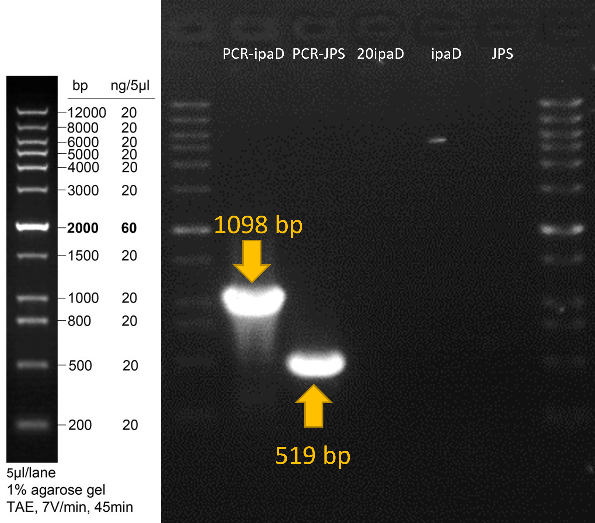
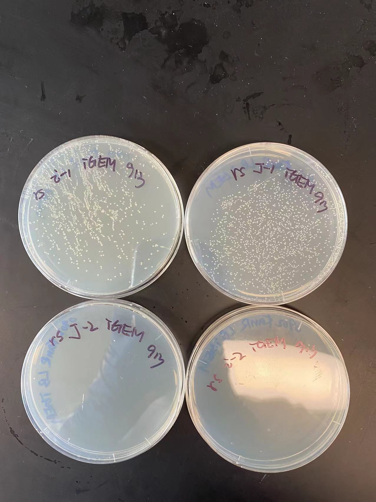
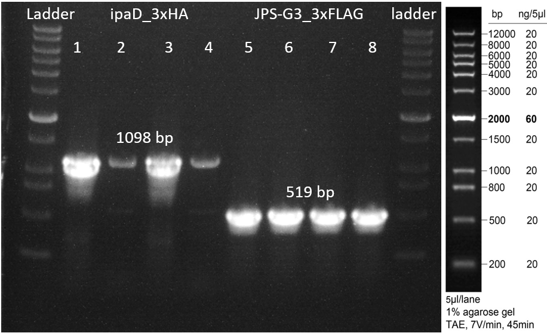

# Results 

## Introduction

This page will give a detailed record about the experiment results.  

## Results

### Yeast

### *Lactococcus lactis*
### *Escherichia coli*

#### Summary of Experiment Design
We plan to display the nanobody JPS-G3 agianst the *Shigella* antigen ipaD on the surface of E.*coli* Nissle 1917 via the curli fiber protein *csg*A (Gelfat et. al., 2021). We expect the engineered E.*coli* Nissle 1917 to be capable of capturing the pathogen (*Shigella flexneri*) via antigen-antibody specific binding. Please check the detailed experiment design at 'design' part. 

#### Plasmid Extraction
pUC19-JPS-G3-3xHA and pUC19-ipaD-3xHA were extracted using the TIANGEN plasmid extraction kit.

### Target Sequence Amplification
Using following primers (**Table 1**), the JPS-G3-3xHA and ipaD-3xHA sequences were successfully amplified, and the results were verified by gel electrophoresis (**Figure 1**). PCR products were purified for further manipulation.

**Table 1** | PCR Primers Used
| Name | Sequence (5' -> 3') | Endonuclease Site |
| --- | --- | --- |
| ipaD_FW | CGCGGATCCATGAATATTACAACTC | *Bam*HI |
| ipaD_RV | GGCCTCGAGTCAAGCGTAG | *Xho*I |
| JPS-G3_FW | CGCGGATCCGGAAGTACACAAGTACAGCTAG | *Bam*HI |
| JPS-G3_RV | CGCGGATCCGGAAGTACACAAGTACAGCTAG | *Xho*I |

**Figure 1** | Gel Electrophoresis Result for Target Sequence Amplification

### Molecular Cloning for Cytoplasmic Protein Expression
In order to construct the recombinant plasmids pET30a-ipaD-3xHA and pET30a-JPS-G3-3xFLAG, the PCR products obtained from the last step were digested by endonucleases *Bam*HI and *Xho*I to create sticky ends. Meanwhile, the pET30a plasmids were transformed into E.*coli* DH5a competent cells for propagation. After transformation and overnight culture, the extracted plasmids were also digested with endonucleases *Bam*HI and *Xho*I to create sticky ends. Afterwards, the digested plasmids and target sequences were ligated and transformed into E.*coli* DH5a competent cells (**Figure 2**). 

**Figure 2** | Plates for pET30a-ipaD-3xHA (i-1 & i-2) and pET30a-JPS-G3-3xFLAG (J-1 & J-2).

Single colonies were picked from the plates and the inserted sequence were verified by colony PCR (**Figure 3**) and Sanger sequencing. 

**Figure 3** | Gel Electrophoresis Result for Colony PCR

### Overlap Extension PCR
In order to construct the recombinant DNA sequences csgA-JPS-G3-3xFLAG and csgA-ipaD-3xHA, the following overlap extension PCR primers are used (**Table 2**).

**Table 2** | Overlap Extension PCR Primers
|Name|Sequence (5' -> 3')|Endonuclease Site|
|---|---|---|
|OvF_csgA-shMT|CCGCGTGGATCCATGAAACTTTTAAAAGTAG|*Bam*HI |
|OvR1_csgA-shMT|TAGCTGTACTTGTGTACTTCCCCGCTGCCGCCGTACTGATGA|/ |
|OvR2_csgA-shMT|TAGTCAGAGTTGTAATATTCATCCGCTGCCGCCGTACTGATGA|/|
|OvF_JPS-G3|CATCAGTACGGCGGCAGCGGGGAAGTACACAAGTACAGCTAGC|/|
|OvR_JPS-G3|GAATCTCGAGTTATTTGTCGTCGTCATCC|*Xho*I|
|OvF_ipaD|CATCAGTACGGCGGCAGCGGATGAATATTACAACTCTGACTAAT|/|
|OvR_ipaD|GGCCTCGAGTCAAGCGTAGTCAGGTAC|*Xho*I|

However, due to time limitation, this part has not been successfully implemented. 

## Reference

* Barta, M., Shearer, J., Arizmendi, O., Tremblay, J., Mehzabeen, N., Zheng, Q., . . . Picking, W. (2017). Single-domain antibodies pinpoint potential targets within Shigella invasion plasmid antigen D of the needle tip complex for inhibition of type III secretion. Journal of Biological Chemistry, 292, jbc.M117.802231. doi:10.1074/jbc.M117.802231

* Gelfat, I., Aqeel, Y., Tremblay, J. M., Jaskiewicz, J. J., Shrestha, A., Lee, J. N., Hu, S., Qian, X., Magoun, L., Sheoran, A., Bedenice, D., Giem, C., Manjula-Basavanna, A., Osburne, M. S., Tzipori, S., Shoemaker, C. B., Leong, J. M., & Joshi, N. S. (2021). Single domain antibodies against enteric pathogen virulence factors are active as curli fiber fusions on probiotic E. coli Nissle 1917 (p. 2021.06.18.448998). bioRxiv. https://doi.org/10.1101/2021.06.18.448998

